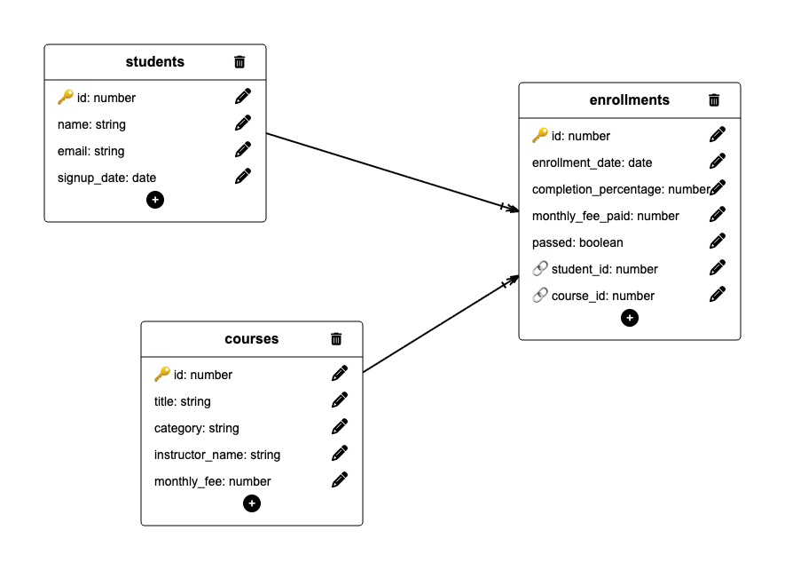

# Informe de auditoría — EduTrack v2 (esquema normalizado)

Auditoría sobre las tablas relacionadas `students`, `courses` y `enrollments`.
Consultas en `queries_v2.sql`. Diagrama entidad-relación en `diagram.png`.

## Diagrama entidad-relación

Relaciones del esquema:
- _(rellena: cómo se relaciona students con enrollments, y courses con enrollments — tipo 1:n / n:m y por qué claves)_

---

## 1. Inscripciones con estudiante, curso y % de completado (INNER JOIN)

Resultado:

| name            | title                  | completion_percentage |
| --------------- | ---------------------- | --------------------- |
| Emily Watson    | Intro to Python        | 85                    |
| Emily Watson    | Web Design Basics      | 60                    |
| Klaus Weber     | Intro to Python        | 92                    |
| Klaus Weber     | Data Analysis with SQL | 78                    |
| Lucia Fernandes | Web Design Basics      | 5                     |
| Lucia Fernandes | Digital Marketing 101  | 3                     |
| Marco Rossi     | Advanced Python        | 95                    |
| Marco Rossi     | Intro to Python        | 88                    |
| Yuki Nakamura   | Data Analysis with SQL | 45                    |
| Yuki Nakamura   | UI/UX Fundamentals     | 0                     |
| Pierre Dubois   | UI/UX Fundamentals     | 0                     |
| Priya Sharma    | Digital Marketing 101  | 70                    |
| Priya Sharma    | Intro to Python        | 55                    |
| Pierre Dubois   | Data Analysis with SQL | 20                    |
| Emily Watson    | Advanced Python        | 40                    |
| Lucia Fernandes | Advanced Python        | 0                     |
## 2. Estudiantes que aprobaron al menos un curso (INNER JOIN)

Resultado:

| name         | title                  | email                             |
| ------------ | ---------------------- | --------------------------------- |
| Emily Watson | Intro to Python        | emily.watson@student.edutrack.com |
| Klaus Weber  | Intro to Python        | klaus.weber@student.edutrack.com  |
| Klaus Weber  | Data Analysis with SQL | klaus.weber@student.edutrack.com  |
| Marco Rossi  | Advanced Python        | marco.rossi@student.edutrack.com  |
| Marco Rossi  | Intro to Python        | marco.rossi@student.edutrack.com  |
| Priya Sharma | Digital Marketing 101  | priya.sharma@student.edutrack.com |

## 3. % de completado medio por instructor (INNER JOIN + AVG)

Resultado:

| instructor_name    | media_completado |
| ------------------ | ---------------- |
| Marta López        | 66.14            |
| Carlos Vega        | 40.00            |
| Lucia Prades       | 36.50            |
| Pending assignment | 0.00             |

## 4. Estudiantes sin ninguna inscripción (LEFT JOIN)

Resultado:

| name          | email                              |
| ------------- | ---------------------------------- |
| Giulia Romano | giulia.romano@student.edutrack.com |

## 5. Cursos sin ninguna inscripción (LEFT JOIN)

Resultado:

| title           |
| --------------- |
| Email Campaigns |

## 6. Estudiantes inscritos en más de un curso (GROUP BY + HAVING)

Resultado:

| name            | numero_cursos |
| --------------- | ------------- |
| Pierre Dubois   | 2             |
| Marco Rossi     | 2             |
| Priya Sharma    | 2             |
| Yuki Nakamura   | 2             |
| Lucia Fernandes | 3             |
| Emily Watson    | 3             |
| Klaus Weber     | 2             |

## 7. Ingresos totales por categoría a precio actual (SUM + GROUP BY)

Resultado:

| category    | ingresos_totales |
| ----------- | ---------------- |
| Programming | 409.93           |
| Data        | 179.97           |
| Design      | 169.96           |
| Marketing   | 59.98            |

Categoría que más ingresos genera: _(rellena)_

## 8. Número de estudiantes por instructor (COUNT + GROUP BY)

Resultado:

| instructor_name    | numero_estudiantes |
| ------------------ | ------------------ |
| Carlos Vega        | 3                  |
| Lucia Prades       | 2                  |
| Marta López        | 6                  |
| Pending assignment | 2                  |

## 9. Inscripciones con student_id huérfano (integridad)

Resultado:

0 Filas

## 10. Inscripciones con course_id huérfano (integridad)

Resultado:

0 Filas
---

